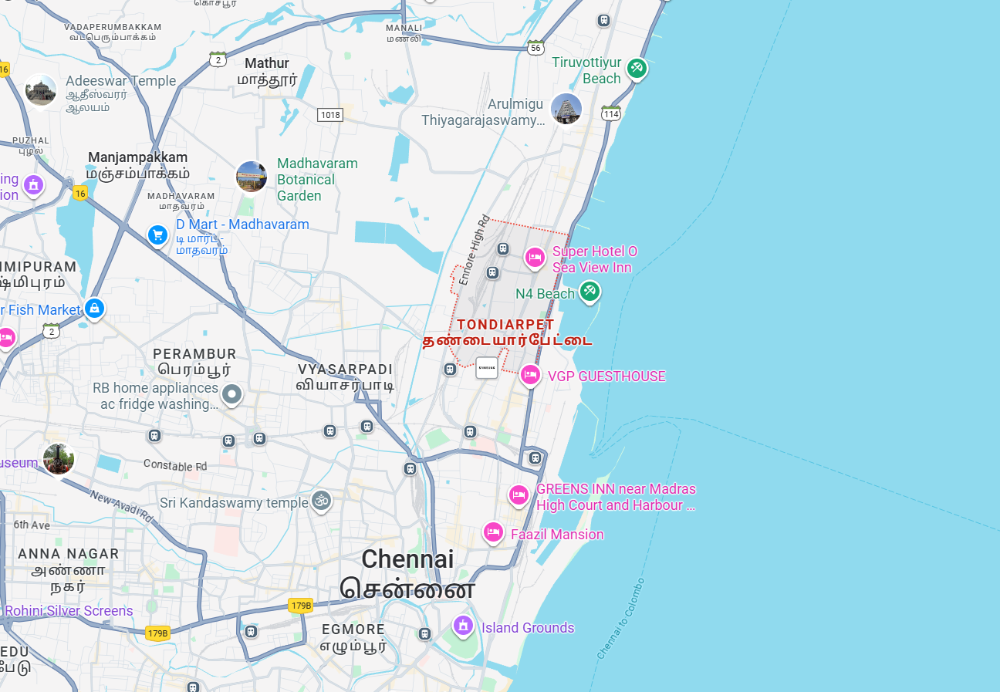

# Ex04 Places Around Me
## Date: 24.09.25

## AIM
To develop a website to display details about the places around my house.

## DESIGN STEPS

### STEP 1
Create a Django admin interface.

### STEP 2
Download your city map from Google.

### STEP 3
Using ```<map>``` tag name the map.

### STEP 4
Create clickable regions in the image using ```<area>``` tag.

### STEP 5
Write HTML programs for all the regions identified.

### STEP 6
Execute the programs and publish them.

## CODE
```

 map.html

<!DOCTYPE html>
<html lang="en">
<head>
  <meta charset="UTF-8">
  <meta name="viewport" content="width=device-width, initial-scale=1.0">
  <title>Chennai Map - Image Map</title>
</head>
<body>
  <h2>Chennai Map - Clickable Locations</h2>

  <!-- Map Image -->
  

  <!-- Image Map -->
  <map name="image-map">
    <area target="_blank" alt="N4 beach" title="N4 beach" href="N4 beach.html" coords="765,373,23" shape="circle">
    <area target="_blank" alt="Tondiarpet Metro" title="Tondiarpet Metro" href="tondiarpet metro.html" coords="574,489,594,469" shape="rect">
    <area target="_blank" alt="High Court Metro" title="High Court Metro" href="high court metro.html" coords="520,597,543,620" shape="rect">
    <area target="_blank" alt="Sri Kandaswamy Temple" title="Sri Kandaswamy Temple" href="sri kandaswamy temple.html" coords="196,634,440,668" shape="rect">
  </map>
</body>
</html>

High court metro.html

<!DOCTYPE html>
<html>
<head>
  <title>High Court Metro</title>
</head>
<body>
  <p>The High Court is the highest judicial authority at the state level in India.</p>
  <p>It deals with civil, criminal, and constitutional matters.</p>
  <p>Every state or group of states has its own High Court.</p>
  <p>The judges of the High Court are appointed by the President of India.</p>
  <p>It plays a vital role in protecting the fundamental rights of citizens.</p>
</body>
</html>

N4 beach.html

<!DOCTYPE html>
<html>
<head>
  <title>N4 Beach</title>
</head>
<body>
  <h1>N4 Beach</h1>
  <p>N4 Beach, also known as Nettukuppam Beach, is located in North Chennai.</p>
  <p>It is popular for its peaceful atmosphere away from the city crowd.</p>
  <p>The beach has a broken pier that attracts visitors and photographers.</p>
  <p>Many locals visit here to enjoy the sunset views and cool breeze.</p>
  <p>N4 Beach is a calm spot for relaxation and short trips.</p>
</body>
</html>

Sri Kandaswamy temple.html

<!doctype html>
<html lang="en">
<head>
  <meta charset="utf-8">
  <meta name="viewport" content="width=device-width,initial-scale=1">
  <title>Sri Kandaswamy Temple — Five Lines</title>
  <style>
    body { font-family: system-ui, -apple-system, "Segoe UI", Roboto, "Helvetica Neue", Arial; padding: 2rem; line-height: 1.6; }
    .line { margin: 0.5rem 0; }
  </style>
</head>
<body>
  <h1>Sri Kandaswamy Temple — Five Lines</h1>
  <p class="line">Sri Kandaswamy Temple is a sacred Hindu shrine dedicated to Lord Murugan (also called Kanda or Skanda).</p>
  <p class="line">The temple is known for its vibrant festivals, colorful processions, and devotional music that draw devotees throughout the year.</p>
  <p class="line">Its architecture blends traditional South Indian temple features such as gopurams, mandapams, and finely carved sculptures.</p>
  <p class="line">Devotees visit Sri Kandaswamy Temple to offer prayers for courage, protection, and success in new endeavors.</p>
  <p class="line">The temple serves as an important cultural and spiritual center for the local community and visiting pilgrims.</p>
</body>
</html>

Tondiarpet metro.html

<!doctype html>
<html lang="en">
<head>
  <meta charset="utf-8" />
  <meta name="viewport" content="width=device-width,initial-scale=1" />
  <title>Tondiarpet Metro — Five Lines</title>
  <style>
    body { font-family: system-ui, sans-serif; max-width: 700px; margin: 40px auto; line-height: 1.6; padding: 0 16px; }
    .line { margin: 8px 0; padding: 10px; background: #f6f8fb; border-left: 4px solid #0077cc; border-radius: 6px; }
    h1 { font-size: 1.3rem; margin-bottom: 12px; }
  </style>
</head>
<body>
  <h1>Tondiarpet Metro — Quick Facts</h1>

  <p class="line">Tondiarpet Metro is a metro station located in the Tondiarpet neighbourhood of Chennai, India.</p>
  <p class="line">It serves as a convenient transit point for residents, workers, and visitors in North Chennai.</p>
  <p class="line">The station connects the area to the wider Chennai Metro network, improving local mobility and reducing travel time.</p>
  <p class="line">Nearby landmarks include local markets, schools, and access routes toward the Chennai Harbor area.</p>
  <p class="line">Commuters benefit from modern station facilities, frequent metro services, and easier first/last-mile connections.</p>
</body>
</html>

```


## OUTPUT


.png>)

.png>)

.png>)

.png>)


## RESULT
The program for implementing image maps using HTML is executed successfully.
